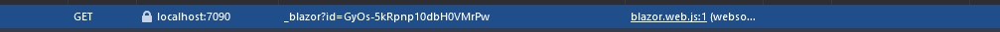
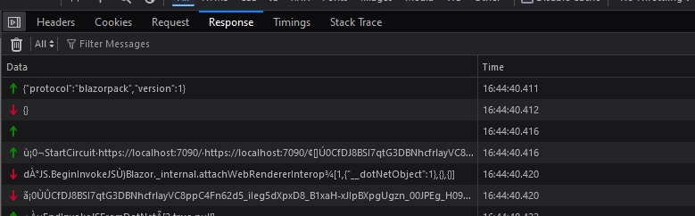
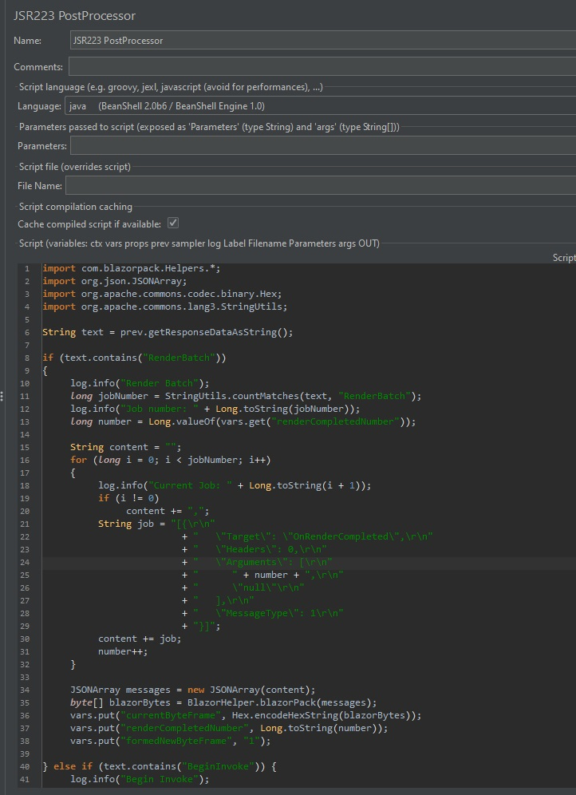
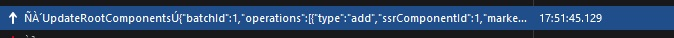
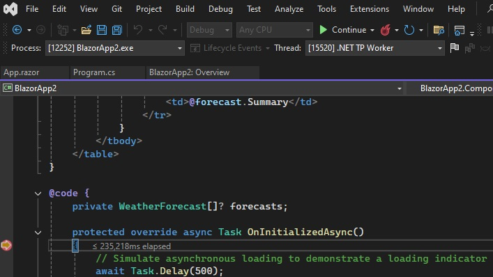

## Guide to Blazor SSR Testing Using Jmeter

### Introduction

Recently, I was tasked with stress testing our Blazor SSR app. I noticed that there are no existing tools for this task, and most of the time, people would recommend creating multiple Selenium or Playwright instances. However, I didn’t like this approach, as opening 20 Selenium instances would fill up all of my 32 GB of RAM. So, I decided to try and make it work with the JMeter WebSocket plugin, since JMeter allows me to create at least 5,000 threads without consuming all of my RAM. For now, everything here is pretty raw in terms of usage, but it gets the job done.

I will use blazor example app with global interactivity and prerender set to false. I'm including the script that I'm using here, so you can try to follow and set it up yourself

### Prerequisites
* Jmeter - https://jmeter.apache.org/
* Jmeter WebSocket Samplers - https://bitbucket.org/pjtr/jmeter-websocket-samplers/downloads/ - place it in **jmeter/lib/ext** folder
* Blazor Traffic Processor - https://github.com/PortSwigger/blazor-traffic-processor - Create jar using build instructions and place it in **jmeter/lib**
* BlazorPack Jar (encodes blazor messages and is based on Blazor Traffic Processor) - **jars** folder - place it in **jmeter/lib** folder
* **Optionally** Burp Suite with Blazor Traffic Processor (Makes creating requests easier)

### Jmeter thread configuration
Add HTTP Cookie Manager, HTTP Header Manager, HTTP Authorization Manager, HTTP Cache manager, User Defined Variables, and WebSocket Ping/Pong Frame Filter.

User Defined Variables are used for creating new requests and keeping track of them (more on that later).


Ping Pong filter is used to filter and respond to pings from server.


Set ping/pong frame filter to discard both ping and pong frames. Also check "Automatically respond to ping with a pong"


### BlazorPack Initialization (Setting Up Websocket)

#### First request analysis
When we load our blazor page the browser sends an http request to get the page and response will be the page's html inside of which are placed values needed to initialize signalr connection (underlined with red).


#### Mimicking with Jmeter


Get the first page using http/https request.


Inside of this request get component state


location hashes


descriptors


prerenderIds


#### Blazor initalizers analysis
After first request the browser requests blazor initializers and negotiates versions which will give us our connection Token


#### Mimicking with Jmeter


HTTP GET blazor initializers


HTTP POST negotiate


JSON Extractor for connection token


#### Instantiating websocket connection analysis
Now our browsers opens websocket connection


#### Mimicking with Jmeter


Open websocket connection with connection token that we extracted before


#### Results so far
This will allow us to start websocket connection with our blazor server


After opening websocket connection communication will be conducted inside of it and in browser everything will be in response tab



### BlazorPack Initialization (Communicating Inside Websocket)

BlazorPack (the protocol that is used in blazor) communicates inside websocket in binary (except initializing version), so we have to be careful to send and receive only binary data

#### Intializing BlazorPack Analysis
After starting websocket connection the browser will send protocol type, version and first ping to the server. All requests can be copied from browser -> right click -> copy as hex/text

Text for protocol and version: ```{"protocol":"blazorpack","version":1} ```


#### Mimicking with Jmeter


Send initialization message as text


Receive binary answer


Send first ping


#### Starting Circuit Analysis
After initializing connection we need to start circuit. To start it we need to send it home page uri, current uri, and a component state that we got earlier


text from browser: ```ù•€¡0¬StartCircuit”·https://localhost:7090/·https://localhost:7090/¢[]Ú0CfDJ8BSI7qtG3DBNhcfrlayVC8r6yY6WkWvDo33AVPbkvy1eX+U1J/iYGm5oNVIOyHqmeR9n87dtFbto9m+jISezPQs6Fv3sFCDT7dfwZ2oDKHlmFFow978mTe8xsKwhAbthzRoX1O0sbpfNFOD1NEFAPDbyz0gPkNa+gsxnxNnyQY3KvKqaI3T5pXThfah0CukaDJg6PGvOlvCYegUVvkE/4+1sQMYLpEx3Y6GmCsRxXfyfY451PC1cuYMU5I5G49XZLquOLQwK7RCbMdc22BplJ9PkFthtpUAA8+JUPDPJUyIopOygbbcwgUV2tRfG24wh7NHnNL+MQmbfAKnp0Ac8fv7VgiJzNsyc/CLiKW4VLJjzfkSAKOgwdl0aXBwPPY6tGV5hVz1pk4xtG+PJA5HNPonsPpwLOB6vHOQmDGHz3fhTYFy0oA1GBFQWpXtl2JZRay2L3v/U1ptvAfTHOZbppK5+BQdsa/R6vrm9QyPCilneynvCEwcqRBqfYGssd4Yape5z/DwkLRlk8XSFbLysy3GoSHPiP3g1PlDABc/+PgpF```

This is where burpsuite with blazor traffic processor comes in handy, since it can decode the messages for blazor.


Decoded: ```[{
   "Target": "StartCircuit",
   "Headers": 0,
   "Arguments": [
      "https://localhost:7090/",
      "https://localhost:7090/",
      [],
      "CfDJ8BSI7qtG3DBNhcfrlayVC8r6yY6WkWvDo33AVPbkvy1eX+U1J/iYGm5oNVIOyHqmeR9n87dtFbto9m+jISezPQs6Fv3sFCDT7dfwZ2oDKHlmFFow978mTe8xsKwhAbthzRoX1O0sbpfNFOD1NEFAPDbyz0gPkNa+gsxnxNnyQY3KvKqaI3T5pXThfah0CukaDJg6PGvOlvCYegUVvkE/4+1sQMYLpEx3Y6GmCsRxXfyfY451PC1cuYMU5I5G49XZLquOLQwK7RCbMdc22BplJ9PkFthtpUAA8+JUPDPJUyIopOygbbcwgUV2tRfG24wh7NHnNL+MQmbfAKnp0Ac8fv7VgiJzNsyc/CLiKW4VLJjzfkSAKOgwdl0aXBwPPY6tGV5hVz1pk4xtG+PJA5HNPonsPpwLOB6vHOQmDGHz3fhTYFy0oA1GBFQWpXtl2JZRay2L3v/U1ptvAfTHOZbppK5+BQdsa/R6vrm9QyPCilneynvCEwcqRBqfYGssd4Yape5z/DwkLRlk8XSFbLysy3GoSHPiP3g1PlDABc/+PgpF"
   ],
   "InvocationId": "0",
   "MessageType": 1
}]```

These decoded messages we can put inside jsr script in jmeter and using blazorpack jar we can encode them with needed parameters and send it back to the server

#### Mimicking with Jmeter


JSR Script: 
```
import com.blazorpack.Helpers.*;
import org.json.JSONArray;
import org.apache.commons.codec.binary.Hex;

String content = "[{\r\n"
				+ "   \"Target\": \"StartCircuit\",\r\n"
				+ "   \"Headers\": 0,\r\n"
				+ "   \"Arguments\": [\r\n"
				+ "      \"https://localhost:7090/\",\r\n"
				+ "      \"https://localhost:7090/\",\r\n"
				+ "      [],\r\n"
				+ "      \"" + vars.get("componentState") + "\"\r\n"
				+ "   ],\r\n"
				+ "   \"InvocationId\": \"0\",\r\n"
				+ "   \"MessageType\": 1\r\n"
				+ "}]";
JSONArray messages = new JSONArray(content);
byte[] blazorBytes = BlazorHelper.blazorPack(messages);
vars.put("startCircuit", Hex.encodeHexString(blazorBytes));
```


We put the message to start circuit inside a variable that we created before in user defined variables, then send it to server


Then we wait for response from server and answer them, which will be explained in the next section


#### Response To Server Loop Analysis
After sending any command to the server, blazor server will respond with invocation and rendering messages, to which we have to respond with confirmation that we finished. Each type of this request has a number that we have to keep track of (which we do in user variables)


#### Mimicking with Jmeter


Read message from server


If no message break out of the loop


Check if any render or invoke message



If there are set next byteFrame to message, increse message type counter, and set flag variable to send message

Script:
```import com.blazorpack.Helpers.*;
import org.json.JSONArray;
import org.apache.commons.codec.binary.Hex;

String text = prev.getResponseDataAsString();
//log.info(text);

if (text.contains("RenderBatch"))
{	
	log.info("Render Batch");
	long number = Long.valueOf(vars.get("renderCompletedNumber"));
	
	String content = "[{\r\n"
					+ "   \"Target\": \"OnRenderCompleted\",\r\n"
					+ "   \"Headers\": 0,\r\n"
					+ "   \"Arguments\": [\r\n"
					+ "      " + number + ",\r\n"
					+ "      \"null\"\r\n"
					+ "   ],\r\n"
					+ "   \"MessageType\": 1\r\n"
					+ "}]";
					
	JSONArray messages = new JSONArray(content);
	byte[] blazorBytes = BlazorHelper.blazorPack(messages);
	vars.put("currentByteFrame", Hex.encodeHexString(blazorBytes));
	vars.put("renderCompletedNumber", Long.toString(++number));
	vars.put("formedNewByteFrame", "1");

} else if (text.contains("BeginInvoke")) {
	log.info("Begin Invoke");
	long number = Long.valueOf(vars.get("endInvokeNumber"));
	
	String content = "[{\r\n"
					+ "   \"Target\": \"EndInvokeJSFromDotNet\",\r\n"
					+ "   \"Headers\": 0,\r\n"
					+ "   \"Arguments\": [\r\n"
					+ "      " + number + ",\r\n"
					+ "      true,\r\n"
					+ "      [\r\n"
					+ "         " + number + ",\r\n"
					+ "         true,\r\n"
					+ "         null\r\n"
					+ "      ]\r\n"
					+ "   ],\r\n"
					+ "   \"MessageType\": 1\r\n"
					+ "}]";
					
	JSONArray messages = new JSONArray(content);
	byte[] blazorBytes = BlazorHelper.blazorPack(messages);
	vars.put("currentByteFrame", Hex.encodeHexString(blazorBytes));
	vars.put("endInvokeNumber", Long.toString(++number));
	vars.put("formedNewByteFrame", "1");
}
```

Check if formed new message


Send message if formed new one


Set flag to send message to false


#### Results so Far
If you got one error message it's fine, because it means that there are no more messages to answer to from server. After starting circuit you have to get BeginInvoke. If something is wrong blazor will close the connection with error message


#### Updating Root Component Analysis
After starting circuit we have to update our root component using descriptors, prerenderIds, and location hashes that we got before



#### Mimicking with Jmeter


Using burp suite extension we can see that updading root is

```[{
   "Target": "UpdateRootComponents",
   "Headers": 0,
   "Arguments": [
      "{\"batchId\":1,\"operations\":[{\"type\":\"add\",\"ssrComponentId\":1,\"marker\":{\"type\":\"server\",\"prerenderId\":\"c6151e8096804138a59d81da58ae78bf\",\"key\":{\"locationHash\":\"77D12F14A8105320B1AAED6AE7E689DA0EC4483270A645E84079EAA0FFDF550D:5\",\"formattedComponentKey\":\"\"},\"sequence\":0,\"descriptor\":\"CfDJ8BSI7qtG3DBNhcfrlayVC8rqArH7XWewMhGO6WyjgXT7z6pTvgwIbpr2bmf5zytoCGg30+RT1X4ekmVZdrnQrL/8fOFPSaipyKb2io2SRQE9MWeEps4M1a+BQBDvpM/BQlnR9/gpTpmiFPO4BXewGH+GcsBJdqRdOOwY/OLAAqSJctWyHWX2rl/0uXMom+HhDMHaKAkNX4hr3I8mQ3U4dosduYr2QQnBLPtOrh3vbYUjkvozGYzSiJ6/YHhwVsLUml43zG4uJcVxhlI1ENVdM2lfXCmGOaa3uHw/wOmX5fwM18It0q+Bo6ft2H6KQoI2VeQPmBFeoGto177Ch/wipDcdlinR2reeHj6fZiT9tnDKZZQcrg8aYpDbwievxN42Tk2tiKfU4gUTGZ64YR4GGm0TKhPqFIZwyBerY4Z3SFn2rVFZOcbZLT9GI9WX/gOeAw/XRuoxNQTvenhIFU+C394S2w9PAHGzl93oEbbJdhDpwy04T6N+2IiRhaelN7aXezInBmWoKAo2IXU8b3pom/g4YJPdcxPLH/46MFF+WiHoJbs2wK09qBpMaTgxFFJmBLhHxC/Hm+TUDbc148VXHjY=\",\"uniqueId\":0}},{\"type\":\"add\",\"ssrComponentId\":2,\"marker\":{\"type\":\"server\",\"key\":{\"locationHash\":\"2481CE1D579B6F530B6E6316DA77756043261FA281C4839D5707FBDF49F7BED3:8\",\"formattedComponentKey\":\"\"},\"sequence\":1,\"descriptor\":\"CfDJ8BSI7qtG3DBNhcfrlayVC8o+V3jd2W8ZelBCsP8BZdmAtnFJMdCQLRi94kTdbxiB+0bNHzO7dKSvfAPxOCI187r0s57I8P1/usYkuE1a4Z7vmD+/I3EKqqzASD/v0UAJGX3+Ka/OBnMqH27lgJP1uCqRragHrntQud/Ln/PNEKCdJqIRVDWdH6OopbyPXrlKJC8wyoneXlc/Po384NsFlpr5Mo0gx3Pha1KIV4HzgCdWEf+R6EUoDJQIIAKGmrdaBvlQUjfofJgsLoCUiOpoqaggEM3w94QvdivUtN9O37IREqavgubc2xM+WA1pvMsIELHmqOeddjQ1Y9jSyZ+7pxXSH1rbv+pb+iTBayAWoVXUn9T0XNc3yqgEKzt18qo76FE2FfU5wwdhSfizh4BXOdDaq1fGLXSWa4pk8DQFcOAijEoANdP4hY+n5ylxgGn/nLPTSBLVvK/DJhV8ZFXkIHUWG/vvLqsUgVdCxWim4yFQr4H1/HOTYdMqK1aTFDqar69vH6hwCb1mucA4wW1A5/k=\",\"uniqueId\":1}}]}",
      "CfDJ8BSI7qtG3DBNhcfrlayVC8o00t5vHeiFKN3advv4j2EvBSvYdVYpnP7pvowd7g0v9meozAwQNPufSzEVhJ+1YthJMhPUGMbGbJlD8Zxccbms2Avx6+ZSajFWJs6bItYx/dUcmVUs0FyvsoTbcCegcG3yG8PSjtU3dhjW0Jq7+Ej9WutM9v6cWoCnnquUYLt3LVrt32mVd0vcJp6wulxU/ZW6TvWYdkXVnxgIYllQX35nhnPwgif7mJGlhQcp9PpSz5UgUNQUautmZ+kUoH+ukKD7QjVWwMqW8oYcG8SyjsjmLfhnlEWlAx3rnU1g0UvEMIRlemCf4pP7P9EdR2B0XmeFJRpaaf4GMV5LZyMxKJ4mJRf0pYHLZHBrK37FKxpHFGYFXKe++CpLOeUFos0uTAQonLCLAesl7zAe0kZxwN2wEAf8jqSP3NC2m7C8776wo/SQ7seXvHmrYHA/c30GkGIzdNaECfzmRbQF8ZH/yazj9NG4gcnTb/X269k4nxlEIavvfITvIpFSbxaq0iPEU8TaxtX1NbOozmtzoktoctDU"
   ],
   "MessageType": 1
}]
```

In Jmeter


Script:
```import com.blazorpack.Helpers.*;
import org.json.JSONArray;
import org.apache.commons.codec.binary.Hex;

String content = "[{\r\n"
				+ "   \"Target\": \"UpdateRootComponents\",\r\n"
				+ "   \"Headers\": 0,\r\n"
				+ "   \"Arguments\": [\r\n"
				+ "      \"{\\\"batchId\\\":1,\\\"operations\\\":[{\\\"type\\\":\\\"add\\\",\\\"ssrComponentId\\\":1,\\\"marker\\\":{\\\"type\\\":\\\"server\\\",\\\"prerenderId\\\":\\\"" + vars.get("prerenderId_1") + "\\\",\\\"key\\\":{\\\"locationHash\\\":\\\"" + vars.get("locationHash_1") + "\\\",\\\"formattedComponentKey\\\":\\\"\\\"},\\\"sequence\\\":0,\\\"descriptor\\\":\\\"" + vars.get("descriptor_1") + "\\\",\\\"uniqueId\\\":0}},{\\\"type\\\":\\\"add\\\",\\\"ssrComponentId\\\":2,\\\"marker\\\":{\\\"type\\\":\\\"server\\\",\\\"key\\\":{\\\"locationHash\\\":\\\"" + vars.get("locationHash_2") + "\\\",\\\"formattedComponentKey\\\":\\\"\\\"},\\\"sequence\\\":1,\\\"descriptor\\\":\\\"" + vars.get("descriptor_2") + "\\\",\\\"uniqueId\\\":1}}]}\",\r\n"
				+ "      \"" + vars.get("componentState") + "\"\r\n"
				+ "   ],\r\n"
				+ "   \"MessageType\": 1\r\n"
				+ "}]";
//log.info(content);
JSONArray messages = new JSONArray(content);
byte[] blazorBytes = BlazorHelper.blazorPack(messages);
vars.put("updateRoot", Hex.encodeHexString(blazorBytes));
```

After that we respond to server with response loop


#### Results so far
We will get "AttachComponent" as well as multiple invoke and render jobs to which update loop will respond


### Loading page
Now we can try to load blazor example weather page to see if debugger catches the loading. I will set breakpoint to OnInitializedAsync on weather page and see if jmeter actually makes the server load it

#### Loading page analysis

When loading a page browser makes this request
```
8•€À±OnLocationChanged“¾https://localhost:7090/weatherÀÃ
```

#### Mimicking with Jmeter


We can copy it as hex, since it's static and put it inside jmeter websocket write sampler


#### Results so far

Caught loading



Jmeter data


### Problems

- After loading a few pages inside websocket in a loop the server stops sending required data (around 5 times of loading same pages), so I would loop websocket initializtion as well, which is basically refreshing our page (You also have to reset render and invoke variables). This is not ideal in testing websocket, but it does also test how blazor responds to disconnecting and connecting websockets with multiple users

### Conclusion and thoughts

- Using this I was able to test one of our servers with 5,000 concurrent users
- I hope this guide helps people with figuring out how to stress test blazor ssr and any input on how to improve this is appreciated